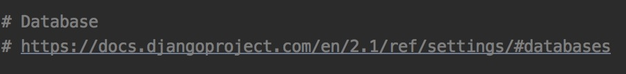

## 全局配置文件settings详解

前面一篇文章说过一些配置，在这里说一个防止迷路的方法，或许细心的你已经发现了，O(∩_∩)O哈哈~。



上图是settings.py配置文件中截取的内容，几乎每一项配置都有相应的连接，帮助你解决配置的问题。

以下是我个人总结的配置信息

#### 1.mysql数据库配置

mysql数据库的配置其实在前一篇文章已经讲过，这里再总结一遍

```python
DATABASES = {
    'default': {
        'ENGINE': 'django.db.backends.mysql',
        'NAME': 'my_app',    #你的数据库名称
        'USER': 'root',   #你的数据库用户名
        'PASSWORD': '123456', #你的数据库密码
        'HOST': '', #你的数据库主机，留空默认为localhost
        'PORT': '3306', #你的数据库端口
        'CHARSET': 'utf8',  # 连接数据库对接的编码
        'TIME_ZONE': 'Asia/Chongqing',  # 设置存数据到数据库时的时区时间
    }
}
#由于mysql默认引擎为MySQLdb，在__init__.py文件中添加下面代码
#在python3中须替换为pymysql,可在主配置文件（和项目同名的文件下，不是app配置文件）中增加如下代码
import pymysql
pymysql.install_as_MySQLdb()
#如果找不到pymysql板块，则通过pip install pymysql进行安装。
```

#### 2.语言

```python
LANGUAGE_CODE = 'en-us'# 默认
LANGUAGE_CODE = 'zh-hans'# 改为中文，主要针对admin页面
```

#### 3.配置模板路径

```python
TEMPLATE_DIRS = (
        os.path.join(BASE_DIR,'templates'),
    )
#然后在项目根目录下添加templates文件夹,
#使用pycharm自动构建django项目时，可以不用手动创建templates文件夹
```

#### 4.注册app

```python
INSTALLED_APPS = [
     'django.contrib.admin',
     'django.contrib.auth',
     'django.contrib.contenttypes',
     'django.contrib.sessions',
     'django.contrib.messages',
     'django.contrib.staticfiles',
     'app1.apps.App1Config', 
     'my_app',
 # 默认已有 如果没有只要添加app名称即可 例如： 'my_app'
 # 新建的应用都要在这里添加,不然你会发现你的应用不会受到django的管理
]
```

#### 5.中间件

例如后面会新增跨域请求中间件，自己写得中间件例如在项目中的md文件夹下md.py文件中的M1与M2两个中间件

```python
MIDDLEWARE = [
    'django.middleware.security.SecurityMiddleware',
    'django.contrib.sessions.middleware.SessionMiddleware',
    'django.middleware.common.CommonMiddleware',
    'django.middleware.csrf.CsrfViewMiddleware',
    'django.contrib.auth.middleware.AuthenticationMiddleware',
    'django.contrib.messages.middleware.MessageMiddleware',
    'django.middleware.clickjacking.XFrameOptionsMiddleware',
    'corsheaders.middleware.CorsMiddleware',
    'md.md.M1',
 	'md.md.M2',
]
```

需要注意的是中间件的执行顺序很重要，所以自己定义的中间件请放在最后面。中间件的执行过程这里简单的说一下，当请求进来时，会依次向下执行列表中中间件中的process_request函数，在没有遇到报错或其他异常情况，在得到响应时，会依次向上执行列表中中间件中的process_response函数。

#### 6.session配置

```python
CACHES = {
    'default': {
        # 通过django-redis的RedisCache对接Redis提供缓存服务
        'BACKEND': 'django_redis.cache.RedisCache',
        # 缓存服务器的URL
        'LOCATION': [
            'redis://host:port/数据库编号',
        ],
        # 缓存的键的前缀（解决命名冲突问题）
        'KEY_PREFIX': 'prefix',
        # 连接缓存服务器的客户端工具配置选项
        'OPTIONS': {
            'CLIENT_CLASS': 'django_redis.client.DefaultClient',
            'CONNECTION_POOL_KWARGS': {
                'max_connections': 512,
            },
            'PASSWORD': 'redis密码',
        }
    },
    'session': {
        'BACKEND': 'django_redis.cache.RedisCache',
        'LOCATION': [
            'redis://host:port/数据库编号',
        ],
        'KEY_PREFIX': 'prefix.session',
        'OPTIONS': {
            'CLIENT_CLASS': 'django_redis.client.DefaultClient',
            'CONNECTION_POOL_KWARGS': {
                'max_connections': 512,
            },
            'PASSWORD': 'redis密码',
        }
    }
}

# 配置会话的存储引擎（默认是数据库此处将其修改为缓存服务）
SESSION_ENGINE = 'django.contrib.sessions.backends.cache'
# 指定使用哪一组缓存服务来保存会话
SESSION_CACHE_ALIAS = 'session'
# 关闭浏览器时让会话过期（保存sessionid的cookie销毁）
SESSION_EXPIRE_AT_BROWSER_CLOSE = True
```

以上是我使用的session设置，并将session存储到redis中的设置。官网session配置请戳[这里](https://www.django.cn/course/show-10.html)。至少目前在我写这篇文章之前遇到的项目，使用上面的session配置已经足以，更多详细设置参见官网。

#### 7.配置静态文件

```python
#STATIC_URL = '/static/'为静态文件别名
STATIC_URL = '/static/'
#静态文件地址拼接，后面'static'文件为自己建立的存放静态文件（JS，IMG，CSS）的文件名
STATICFILES_DIRS = (
    os.path.join(BASE_DIR, 'static'), #主文件下静态文件
    os.path.join(BASE_DIR,"my_app","statics"),#项目my_app文件下静态文件
```

#### 8.打印日志配置

```python
LOGGING = {
    'version': 1,
    # 是否禁用已经存在的日志器
    'disable_existing_loggers': False,
    # 日志格式化器
    'formatters': {
        'simple': {
            'format': '%(asctime)s %(module)s.%(funcName)s: %(message)s',
            'datefmt': '%Y-%m-%d %H:%M:%S',
        },
        'verbose': {
            'format': '%(asctime)s %(levelname)s [%(process)d-%(threadName)s] '
                      '%(module)s.%(funcName)s line %(lineno)d: %(message)s',
            'datefmt': '%Y-%m-%d %H:%M:%S',
        }
    },
    # 日志过滤器
    'filters': {
        # 只有在Django配置文件中DEBUG值为True时才起作用
        'require_debug_true': {
            '()': 'django.utils.log.RequireDebugTrue',
        },
    },
    # 日志处理器
    'handlers': {
        # 输出到控制台
        'console': {
            'class': 'logging.StreamHandler',
            'level': 'DEBUG',
            'filters': ['require_debug_true'],
            'formatter': 'simple',
        },
    },
    # 日志器记录器
    'loggers': {
        'django.db.backends': {
            # 需要使用的日志处理器
            'handlers': ['console', ],
            # 是否向上传播日志信息
            'propagate': True,
            # 日志级别(不一定是最终的日志级别)
            'level': 'DEBUG',
        },
    }
}
```

关于日志的级别配置CRITICAL、ERROR、WARNING、INFO、DEBUG、NOTSET，自行根据需要配置

#### 9.配置文件上传目录

```python
#设置文件上传路径
MEDIA_URL = '/media/'
MEDIA_ROOT = os.path.join(BASE_DIR, 'media/')

```

如果想在浏览器里访问自己上传的文件则需要在urls.py做如下设置：

```python
from django.views.static import serve
from django.conf import settings

urlpatterns = [
    ...
    re_path('^media/(?P<path>.*)$', serve, {'document_root': settings.MEDIA_ROOT}),
]
```

最后附上官网推荐的最佳配置实例代码：

```python
import os
import socket
SITE_ID = 1
# 项目的根目录
# 简化后面的操作
PROJECT_ROOT = os.path.dirname(os.path.dirname(__file__))
# 加载应用
# 把应用添加到INSTALLED_APPS中
from apps.kuser.mysetting import myapp as kuser_app
from apps.blog.mysetting import myapp as blog_app
MY_APPS = blog_app + kuser_app
# 加载静态文件
from apps.blog.mysetting import my_staticfiles as blog_staticfiles
from apps.kuser.mysetting import my_staticfiles as kuser_staticfiles
MY_STATIC_DIRS = blog_staticfiles + kuser_staticfiles
# 加载模板文件
from apps.blog.mysetting import my_templates as blog_templates
from apps.kuser.mysetting import my_templates as kuser_templates
MY_TEMPLATE_DIRS = blog_templates + kuser_templates
# 密钥配置
# 适用于开发环境和部署环境
# 可以从系统环境中，配置文件中，和硬编码的配置中得到密钥
try:
 SECRET_KEY = os.environ['SECRET_KEY']
except:
 try:
 with open(os.path.join(PROJECT_ROOT, 'db/secret_key').replace('\\', '/')) as f:
  SECRET_KEY = f.read().strip()
 except:
 SECRET_KEY = '*lk^6@0l0(iulgar$j)faff&^(^u+qk3j73d18@&+ur^xuTxY'
# 得到主机名
def hostname():
 sys = os.name
 if sys == 'nt':
 hostname = os.getenv('computername')
 return hostname
 elif sys == 'posix':
 host = os.popen('echo $HOSTNAME')
 try:
  hostname = host.read()
  return hostname
 finally:
  host.close()
 else:
 raise RuntimeError('Unkwon hostname')
#调试和模板调试配置
#主机名相同则为开发环境，不同则为部署环境
#ALLOWED_HOSTS只在调试环境中才能为空
if socket.gethostname().lower() == hostname().lower():
 DEBUG = TEMPLATE_DEBUG = True
 ALLOWED_HOSTS = []
else:
 ALLOWED_HOSTS = [
 'baidu.com',
 '0.0.0.0',
 ]
 DEBUG = TEMPLATE_DEBUG = False
#数据库配置
MYDB = {
 'mysql': {
 'ENGINE': 'django.db.backends.mysql',
 'NAME': 'books', #你的数据库名称
 'USER': 'root', #你的数据库用户名
 'PASSWORD': '', #你的数据库密码
 'HOST': '', #你的数据库主机，留空默认为localhost
 'PORT': '3306', #你的数据库端口
 },
 'sqlite': {
 'ENGINE': 'django.db.backends.sqlite3',
 'NAME': os.path.join(PROJECT_ROOT, 'db/db.sqlite3').replace('\\', '/'),
 }
}
# 给静态文件url一个后缀，在templates里用到的。
# 映射到静态文件的url
# STATIC_URL的含义与MEDIA_URL类似
STATIC_URL = '/static/'
# 总的static目录
# 可以使用命令 manage.py collectstatic 自动收集static文件
# STATIC_ROOT = os.path.join(PROJECT_ROOT, 'static').replace('\\', '/')
#放各个app的static目录及公共的static目录
#STATICFILES_DIRS：和TEMPLATE_DIRS的含义差不多，就是除了各个app的static目录以外还需要管理的静态文件设置，
#比如项目的公共文件差不多。然后给静态文件变量赋值，告诉Django，静态文件在哪里
#另外，Django提供了一个findstatic命令来查找指定的静态文件所在的目录，例如：D:\TestDjango>python manage.py findstatic Chrome.jpg
# 默认情况下（如果没有修改STATICFILES_FINDERS的话），Django首先会在STATICFILES_DIRS配置的文件夹中寻找静态文件，然后再从每个app的static子目录下查找，
# 并且返回找到的第一个文件。所以我们可以将全局的静态文件放在STATICFILES_DIRS配置的目录中，将app独有的静态文件放在app的static子目录中。
# 存放的时候按类别存放在static目录的子目录下，如图片都放在images文件夹中，所有的CSS都放在css文件夹中，所有的js文件都放在js文件夹中。
STATICFILES_DIRS = (
 ("downloads", os.path.join(PROJECT_ROOT, 'static/downloads').replace('\\', '/')),
 ("uploads", os.path.join(PROJECT_ROOT, 'static/uploads').replace('\\', '/')),
)
# 将app中的静态文件添加到静态文件配置列表中
STATICFILES_DIRS += MY_STATIC_DIRS
# 最后关键的部分是STATICFILES_DIRS以下配置
# 简要说一下，static文件夹在项目里，有css js images 三个文件夹（看项目结构），他们的路径分别是：
# os.path.join(STATIC_ROOT,'css')，os.path.join(STATIC_ROOT,'js')，os.path.join(STATIC_ROOT,'images')；
# 我们分别给他们起三个别名css，js，images（你可以随意给，不过为了易记，我们原名称指定别名了）
TEMPLATE_DIRS = (
 os.path.join(PROJECT_ROOT, 'templates').replace('\\', '/'),
)
# 配置应用的模板文件路径
TEMPLATE_DIRS += MY_TEMPLATE_DIRS
# 配置缓存
 CACHES = {
 'default': {
  'BACKEND': 'django.core.cache.backends.memcached.MemcachedCache',
  'LOCATION': 'unix:/tmp/memcached.sock',
  'KEY_PREFIX': 'lcfcn',
  'TIMEOUT': None
 }
 }
LOGIN_REDIRECT_URL = '/'
LOGIN_URL = '/auth/login/'
LOGOUT_URL = '/auth/logout/'
# 指用户上传的文件，比如在Model里面的FileFIeld，ImageField上传的文件。如果你定义
# MEDIA_ROOT=c:\temp\media，那么File=models.FileField(upload_to="abc/")，上传的文件就会被保存到c:\temp\media\abc。MEDIA_ROOT必须是本地路径的绝对路径。
MEDIA_ROOT = os.path.join(PROJECT_ROOT, 'static/uploads')
# MEDIA_URL是指从浏览器访问时的地址前缀。
MEDIA_URL = '/uploads/'
# 应用注册列表
INSTALLED_APPS = (
 'django.contrib.admin',
 'django.contrib.auth',
 'django.contrib.contenttypes',
 'django.contrib.sessions',
 'django.contrib.messages',
 'django.contrib.staticfiles',
 'django.contrib.sites',
 'django.contrib.sitemaps',
)
#为了不和系统应用混合，自己开发的应用放在这里
# 将自己写的app添加到应用列表中去
INSTALLED_APPS += MY_APPS
# django 中间件
# django处理一个Request的过程是首先通过django 中间件，然后再通过默认的URL方式进行的。
# 所以说我们要做的就是在django 中间件这个地方把所有Request拦截住，
# 用我们自己的方式完成处理以后直接返回Response,那么我们可以简化原来的设计思路，
# 把中间件不能处理的 Request统统不管，丢给Django去处理。
MIDDLEWARE_CLASSES = (
 'django.middleware.cache.UpdateCacheMiddleware',
 'django.contrib.sessions.middleware.SessionMiddleware',
 'django.middleware.common.CommonMiddleware',
 'django.middleware.csrf.CsrfViewMiddleware',
 'django.contrib.auth.middleware.AuthenticationMiddleware',
 # 'django.contrib.auth.middleware.SessionAuthenticationMiddleware',
 'django.contrib.messages.middleware.MessageMiddleware',
 'django.middleware.clickjacking.XFrameOptionsMiddleware',
 'django.middleware.cache.FetchFromCacheMiddleware',
)
ROOT_URLCONF = 'lcforum.urls'
WSGI_APPLICATION = 'lcforum.wsgi.application'
#数据库配置
DATABASES = {
 'default': MYDB.get('sqlite'),
}
# 语言
LANGUAGE_CODE = 'zh-cn'
# 时区
TIME_ZONE = 'Asia/Shanghai'
USE_TZ = True
# 在template中使用静态文件
# 采用这种方式需要有一些额外配置，打开settings.py，确认TEMPLATE_CONTEXT_PROCESSORS中包含有'django.core.context_processors.static'
# TEMPLATE_CONTEXT_PROCESSORS = (
# 'django.core.context_processors.debug',
# 'django.core.context_processors.i18n',
# 'django.core.context_processors.media',
# 'django.core.context_processors.static',
# 'django.contrib.auth.context_processors.auth',
# 'django.contrib.messages.context_processors.messages',
#
# 'django.core.context_processors.tz',
# 'django.contrib.messages.context_processors.messages',
# # 'blog.context_processors.custom_proc',自定义函数
# )
#from django.conf import settings
#gettext = lambda s: s
#getattr()
# 假设有个工程mysite，有两个app为blog跟bbs
# django处理static的方法是把各个app各自的static合并到一处
# 比如:
# mysite/mysite/static 放置公共静态文件
# mysite/bbs/static 放置该app自己的静态文件
# mysite/blog/static 放置该app自己的静态文件
# 可以这么设置：
# STATIC_ROOT = '/www/mysite/mysite/static '
# STATIC_URL = '/static/'
# STATICFILES_DIRS = (
# 'mysite/static',
# 'bbs/static/',
# 'blog/static/',
# )
# 使用命令
# manage.py collectstatic
# 就会自动把所有静态文件全部复制到STATIC_ROOT中
# 如果开启了admin，这一步是很必要的，不然部署到生产环境的时候会找不到样式文件
# 不要把你项目的静态文件放到这个目录。这个目录只有在运行python manage.py collectstatic时才会用到
```