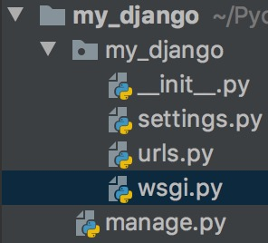

### 1. 创建Django项目

#### 1.1 方式一

创建django项目可以使用专业版的Pycharm进行创建，创建之后你会得到一个最原始的django项目，他的目录结构为



以上没有给出模板的文件夹，目的是为了方便结合第二种方式讲解。先简单说一下templates，在使用pycharm创建django项目时，除了命名、创建虚拟环境，还有一个more settings的选项，在里面可以选择template模板的语法(Django、jinja2两种)，以及模板文件夹的名称，默认templates，建议不要改，要不然还得去改其他的配置文件。

#### 1.2 方式二

创建一个普通的项目，项目名为你要写的django项目名，选择自己使用的对应版本的python，在pycharm的terminal中pip install django==2.1.8安装你想使用的django版本。接下来使用django-admin —version查看到对应的版本号，就证明安装成功，接下来使用一下命令创建django项目

```code
django-admin startproject my_django .
```

**注意**：这个命令的最后有一个"."，代表在当前目录下创建django项目，如果不加“.”，django-admin就会在当前目录下创建一个项目名文件夹，然后再这个文件夹里面再创建项目，加上方式二创建项目的时候就已经自己创建了一个叫项目名的文件夹，就有三个项目名的文件夹了。

接下来介绍一下项目的每个文件夹

**__init__.py**:一个空文件，它告诉Python这个目录应该被看做一个Python包

**settings.py**:项目配置文件

**urls.py**:URL对应关系（路由）

**wsgi.py**:遵循WSIG规范，uwsgi + nginx(一个web服务器，关于此知识，以后总结到其他文章)

**manage.py**：一个命令行工具，可以使你用多种方式对Django项目进行交互，例如通过命令行启动整个django项目、创建应用、执行ORM模型的迁移和反迁移等

### 2. 启动Django

```code
python manage.py runserver
```

django服务默认启动在本地的8000端口，可以在该命令后加上主机和端口设置

```code
python manage.py runserver 0.0.0.0:8000
```

以上命令表示所有主机都可访问启动在本机8000端口的django项目

此时便可在浏览器直接输入本机的ip地址加端口号进行django项目的访问，django有一个自带的web页面。

### 3. 创建web应用

```python
python manage.py startapp my_app   # 方式一
django-admin startapp my_app   # 方式二
```

以上命令创建好的应用结构如下：


**migrations**:数据迁移、移植文目录，记录数据库操作记录，内容自动生成

**admin.py**:应用后台管理配置文件

**apps.py**:应用的配置文件

**models.py**:数据模块，数据库设计就在此文件中设计

**tests.py**:自动化测试模块，可在里面编写测试脚本自动化测试

**views.py**:视图文件，用来执行响应代码的。你在浏览器所见所得都是它处理的

此时该应用app还没有生效，需要在项目的settings.py文件中注册该应用,如下图所示


这样我们就创建好一个应用，并让它生效了。

修改语言和时区

```python
# 把语言改为中文
# LANGUAGE_CODE = 'en-us'
LANGUAGE_CODE = 'zh-hans'
# 把国际时区改为中国时区
# TIME_ZONE = 'UTC'
TIME_ZONE = 'Asia/Shanghai'  # 'Asia/Chongqing'
```

在views.py文件编写视图函数

```python
from django.http import HttpResponse

def index(request):
    return HttpResponse('Hello Django')
```

在urls.py文件中写路由

```python
from django.contrib import admin
from django.urls import path

from my_app import views    #+

urlpatterns = [
    path('admin/', admin.site.urls),
    path('index/', views.index),    #+
]
# path第一个参数是定义的路由，第二个是对应的视图函数
```

**注意**：django文档给出了一种标识自己新添加代码的方式“#+”

现在启动项目，访问项目地址，就可以看到视图函数中返回的值了

可能对于萌新来说，还不知道到怎么去访问刚才我们写得内容，这里做简要说明。前面说到了启动django项目要么启动在127.0.0.1只能本地进行访问，要么启动在0.0.0.0上，允许所有主机通过公网ip访问，再加上django默认的端口8000，或者你自己设置的其他端口前缀的http协议加上。整个完整的url就是http://127.0.0.1:8000,称之为url(统一资源定位符，不了解只有百度了)。这个url只能是没有自行在urls文件中加入除了“/”路由的其他路由时访问，结果会是django自带的index.html。而当像我一样设置了一个index/的路由时，就只能访问http://127.0.0.1:8000/index/才能得到刚才视图函数返回的字符串。至于出现的404结果页面是django的debug调试页面，以后再详讲。

官网给出的url的一般写法

```python
urlpatterns = [
    path(正则表达式, views视图函数，参数，别名),
]
参数说明：
1、一个正则表达式字符串
2、一个可调用对象，通常为一个视图函数或一个指定视图函数路径的字符串
3、可选的要传递给视图函数的默认参数（字典形式）
4、一个可选的name参数(别名),此别名将用于视图函数中重定向redirect函数的参数，以重定向到指定的路由，也可用于模板页面url的反向解析
```

### 4. path转换器

路径参数

```python
from django.urls import path
from . import views
urlpatterns = [
    path('articles/2003/', views.special_case_2003),
    path('articles/<int:year>/', views.year_archive),
    path('articles/<int:year>/<int:month>/', views.month_archive),
    path('articles/<int:year>/<int:month>/<slug:slug>/', views.article_detail),
    ]
```

Django默认情况下内置下面的路径转换器：

1、str：匹配任何非空字符串，但不含斜杠/，如果你没有专门指定转换器，那么这个是默认使用的；
2、int：匹配0和正整数，返回一个int类型
3、slug：可理解为注释、后缀、附属等概念，是url拖在最后的一部分解释性字符。该转换器匹配任何ASCII字符以及连接符和下划线，比如’ building-your-1st-django-site‘；
4、uuid：匹配一个uuid格式的对象。为了防止冲突，规定必须使用破折号，所有字母必须小写，例如’075194d3-6885-417e-a8a8-6c931e272f00‘ 。返回一个UUID对象；(uuid是一个除开连接符“-”的32位的字符串，通常被用于唯一标识一个事物，结构为8-4-4-4-12)
5、path：匹配任何非空字符串，重点是可以包含路径分隔符’/‘。这个转换器可以帮助你匹配整个url而不是一段一段的url字符串。

django允许自定义转换器，具体[参见官网](https://www.django.cn/course/show-7.html)

还可使用正则表达式re_path，引用官网的例子：

```python
from django.urls import path, re_path
from . import views
urlpatterns = [
    path('articles/2003/', views.special_case_2003),
    #表示articles/2003/这个路径映射views模块的special_case_2003函数
    re_path(r'^articles/(?P<year>[0-9]{4})/$', views.year_archive),
    #表示匹配4个0-9的任意数字
    re_path(r'^articles/(?P<year>[0-9]{4})/(?P<month>[0-9]{2})/$', views.month_archive),
    re_path(r'^articles/(?P<year>[0-9]{4})/(?P<month>[0-9]{2})/(?P<slug>[\w-]+)/$', views.article_detail),
    ]
#注意:上面匹配都加了小括号，这些括号里面的值会当作参数传递到后面的视图函数中
```

re_path与path()不同的主要在于两点：
1、year中匹配不到10000等非四位数字，这是正则表达式决定的
2、传递给视图的所有参数都是字符串类型。而不像path()方法中可以指定转换成某种类型。

3、re_path是完完全全根据正则表达式匹配

**注意**：讲解一下视图函数接受路径参数的形式，直接作为视图函数的参数接收，例如：def index(request, name, year, month)

### 5. urls分层模块化(路由分发)

通常，我们会在每个app里，各自创建一个urls.py路由模块，然后从根路由出发，将app所属的url请求，全部转发到相应的urls.py模块中。读完这句话可能还是不太明白，接下来我会以之前创建的my_app应用举个例子，等到后面具体集合项目分析时，我再详细说明一下路由分发的具体表现以及它的强大作用在哪里。

```python
from django.urls import include, path
urlpatterns = [
    path('my_app/', include('my_app.urls')),
]
```

以上path的意思是将my_app/这个前缀路由分发给include里面的my_app应用下面的urls.py文件里面定义的路由，这样一来，一个前缀路由只用写一次，就可以被很多路由共用，是不是觉得很高大上。接下来具体举例my_qpp应用中urls.py文件中url的写法：

```python
from django.urls import path
from . import views
urlpatterns = [
    path('index/', views.index),
]
```

这样请求的整个url就为http://127.0.0.1:8000/my_app/index/

当然还可以在my_app应用的urls,py中定义很多其他路由，它的前缀都为http://127.0.0.1:8000/my_app/

**url的反向解析**：直接上官网示例

```python
from django.urls import path
from . import views
urlpatterns = [
    #...
    path('my_app/<int:year>/', views.year_archive, name='news-year'),
    #...
]
```

某一年nnnn对应的归档的URL是`/my_app/nnnn/`。

可以在模板templates的代码中使用下面的方法获得它们：

```python
<a href="">2012 Archive</a>
{# Or with the year in a template context variable: #}
<ul>
```

以上使用的是django模板语法，关于jinja2语法，在我flask分类文章中可以找到。

此时启动django服务，访问连接http://127.0.0.1:8000/my_app/2019/便可看到2012 Archive的蓝色超链接。打开检查工具会看到此时a标签的href便是/my_app/2012/，是不是感觉很神奇。这就是django的强大。以后你可以随便修改url，即使页面中有很多这个url，只要path中参数name的值不变，你就会感觉无比的方便。

### 6. Django中的MVC(MTV)开发模式

先讲解一下models、templates、views三个文件或文件夹：

1、models，数据模型：这是一个抽象层，用来构建和操作你的web应用中的数据，模型是你的数据的唯一的、权威的信息源。它包含你所储存数据的必要字段和行为。通常，每个模型对应数据库中唯一的一张表。这里面对应的是ORM(Object Relational Mapping，对象关系映射)框架的“对象”部分，关于ORM的知识，不了解就请移步度娘。这个对象就是创建一个类，然后实例化它的对象去查询和存储数据。

2、templates，模板：模板层，负责怎么样显示数据，说白了，就是利用一些格式化的html文件，使数据按照要求显示（显示在哪里，怎么显示等等）。前后端分离开发时，这个模板层就不会存在。

3、views，视图：用于封装负责处理用户请求及返回响应的逻辑。视图可以看作是前端与数据库的中间人，它会将前端想要的数据从数据库中读出来给前端。他也会将用户要想保存的数据写到数据库。在这里就会用到models中的模型实例。

接下来再说说MVC(MTV)是什么

之后的DjangoWeb开发之后，我们都要按这样的流程，或者说是按照这样的开发模式进行开发。这样的开发模式我们把它叫**MVC开发模式**。

以下是 Django 中 M、V 和 C 各自的含义：
**M** ：数据存取部分，由django数据库层处理，本章要讲述的内容。 
**V**：选择显示哪些数据要显示以及怎样显示的部分，由视图和模板处理。
**C**：根据用户输入委派视图的部分，由 Django 框架根据 URLconf 设置，对给定 URL 调用适当的 Python 函数。

在Django里，由于 C层由框架自行处理，而 Django 里更关注的是模型（Model）、模板(Template)和视图（Views），所以Django 也被称为 MTV框架 。在MTV开发模式中：
**M** ：代表模型（Model），即数据存取层。 该层处理与数据相关的所有事务： 如何存取、如何验证有效
**T** ：代表模板(Template)，即表现层。 该层处理与表现相关的决定： 如何在页面或其他类型文档中进行显示。
**V** ：代表视图（View），即业务逻辑层。 该层包含存取模型及调取恰当模板的相关逻辑。 你可以把它看作模型与模板之间的桥梁。


接下来再看一看每个文件中的代码如何实现

**models.py**:

```python
from django.db import models


class Article(models.Model):
    # 官网的第一个位置参数verbose_name没有给出，其实看底层继承的类就会知道，这里予以补充说明，verbose_name这个参数的意义在于规定这个字段在Django自带的后台管理应用中显示它的值，稍后以图片形式说明
    title = models.CharField(verbose_name="标题", max_length=70)
    body = models.TextField(verbose_name='内容', ax_length=2000, blank=True)    # blank是否允许为空
    create_time = models.DateTimeField(verbose_name='发布时间')
    
    class Meta:
        db_table = 'tb_article'
```

迁移？且慢，还有一道菜，数据库都没连……，官网的教程估计是我看漏了，下面直接上我项目中的代码：

```python
# DATABASES = {
#     'default': {
#         'ENGINE': 'django.db.backends.sqlite3',
#         'NAME': os.path.join(BASE_DIR, 'db.sqlite3'),
#     }
# }
DATABASES = {
    'default': {
        'ENGINE': 'django.db.backends.mysql',
        'NAME': 'my_app',
        'HOST': '127.0.0.1',
        'PORT': 3306,
        'USER': 'root',
        'PASSWORD': '123456', 
        'CHARSET': 'utf8',
        'TIME_ZONE': 'Asia/Shanghai',
    }
}
```

配置还以上信息之后还有一道菜，需要安装操作数据库的工具，这里使用的是pymysql

```python
pip install pymysql
```

还需要在项目文件夹下的\__init\_\_.py文件中加入pymysql

```python
import pymysql

pymysql.install_as_MySQLdb()
```

因为django默认使用的是MySQLdb来进行数据库的操作，pymysql同时也考虑到了这一点，所以上面这句话的意思就是将pymysql安装成像MySQLdb这样来使用。

接下来就可以愉快的将你定义在models.py中的模型迁移到你指定的数据库啦。

奉上迁移命令，请确保在项目的manage.py路径下执行下面的命令，不然你会进入”沙漠取水“的困境。

```python
python manage.py makemigrations    # 构建迁移
python manage.py migrate    # 执行迁移
```

以上命令没报错，name恭喜你，可以在migrations看到新产生的迁移文件，以及数据库中看到如下图的信息


上图就是成功迁移之后数据库中的表，除了最后一个表是自己创建之外，其他所有代表都是django底层帮你创建的。接下来我只介绍常用的或者你暂时用得着的几个表：

**auth_user**:用于存放后台管理员的账号、密码、邮箱、最后登录后台时间、是否是超级用户等信息

**django_admin_log**:存放管理后台的修改内容的日志

**django_content_type**:存放app应用对应的模型类有哪些

**django_migrations**:存放执行模型迁移的app应用和迁移文件以及迁移时间

**django_session**：存放session的键、值以及创建时间，不了解session，请百度先！

说了这么多，你或许已经发现最后一个表的名字是项目名加模型名的小写组成。这是在没有自定义标明的额情况下，django给我们自定义的表名。当然也可以自己定义表明。为了区分，我故意将模型总原类Meta中的字段db_table给删除了，如果安装我上面定义的models.py文件的模型定义db_table = 'tb_article'，那么你将会在你的数据库中看到tb_article的表，而不再是my_app_article。

**总结：好了，关于模型的建立、数据库的配置等都弄好了，如果报了什么错误，请自行检查命令和问价内容是否和我写得一样。如果还是不行，请移步[官网 ](https://www.django.cn/course/show-8.html)，官网最下边甚至还给出了建立整个模型的源码，可自行下载研究。另外本文没有给出后台管理的相关配置，可以看官网进行配置，若有不懂，请留言**