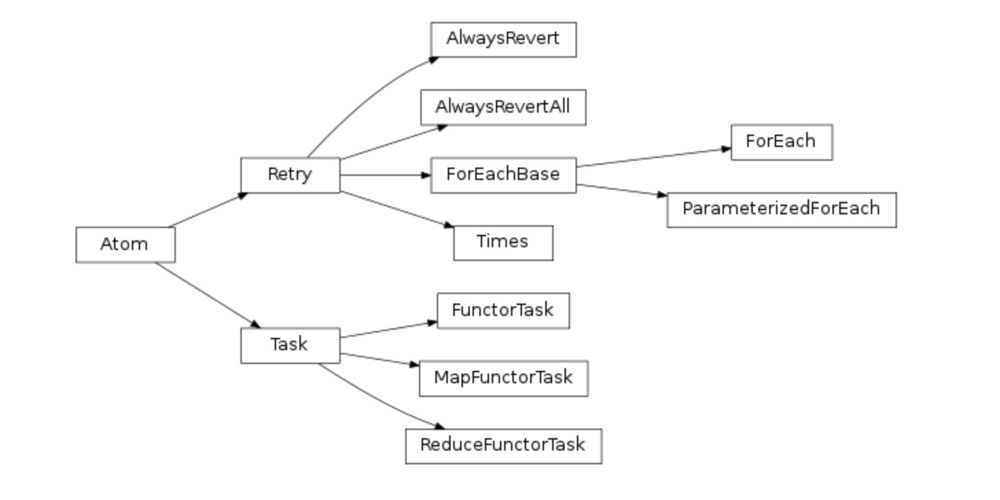

**Atom**

　　atom是“原子”的意思，在TaskFlow中代表流中的最小单元。
　　类Atom表示的是使流向前推进的一个工作单元。它期望一个输入的数据，然后经过处理后，产生一个输出。它具有一个名字和一个版本号，它期望有输入名和输出名。类Atom是一个抽象类，无法直接实例化。
　　下面，我们来介绍类Atom本身。

**构造方法参数**

　　name：atom的名称
　　provides：以集合、字符串或者列表的形式表示供应
　　inject：注入内容，以字典的形式提供注入的内容
　　rebind：以字典的形式，转化参数的名称
　　revert_rebind：与rebind相同，不同的是revert_rebind是为revert()准备的
　　requires：以集合或者列表的形式提供必需的输入
　　revert_requires：与requires相同，不同的是revert_requires是为revert()准备的

**类变量**

　　priority：表示优先级，默认值是0，值越大，表示优先级越高　　default_provides：默认的provides，默值为None

**属性**

　　version：以元组的形式表示版本号，包含主版本号和次版本号两部分。
　　save_as：以OrderedDict的形式保存输出的内容。
　　rebind：以OrderedDict的形式保存命名空间的重新映射
　　revert_rebind：与rebind相同，不同的是revert_rebind是为revert()准备的
　　inject：与构建方法的参数inject相同
　　Atom.name：与构建方法的参数name相同
　　optional：以OrderedSet的形式保存的为execute()准备的可选输入
　　revert_optional：revert版的optional
　　provides：以OrderedSet的形式保存的此atom产生的输出
　　requires：以OrderedSet的形式提供必需的输入

**方法**

　　pre_execute()：在execute()之前执行的方法。通常在这个方法中填写初始化的代码
　　execute()：atom实际执行重要操作的代码。atom的输入会传入execute()的参数中；execute()的返回值会作为atom的输出，并将此输出保存到存储层
　　post_execute()：在execute()之后执行的方法。通常在这个方法中填写清理的代码，例如清理共享的全局数据库session
　　pre_revert()：在revert()之前执行的方法
　　revert()：恢复此atom，这个方法用来撤销之前执行的代码产生的负面影响。如果在execute()中发生失败时，就会触发revert()的执行
　　post_revert()：在revert()之后执行的方法

**类Atom的继承关系**

　　类Atom是其它最小单元的基类，例如：类Task和类Retry。

