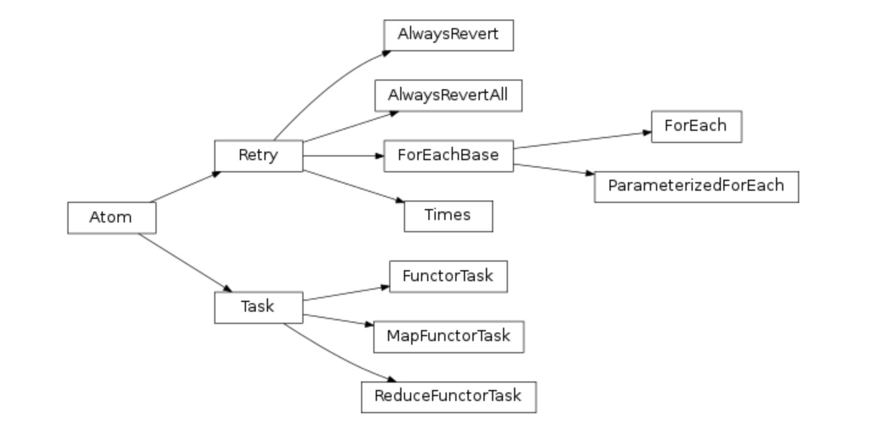

**Task**

　　任务task表示流中的一个基本执行单元，也是最常用的单元，它主要包含执行和回滚的代码，其中回滚是可选的。


**类Task**

　　类Task代表任务task，是从类Atom派生出来的，也是一个抽象类，无法直接实例化。通常，开发者需要从类Task派生出新类，并实现execute()方法和revert()方法，其中revert()是可选的，execute()表示任务实质执行的内容，而revert()表示任务执行过程中出错执行的回滚内容。下面是一个简单的例子：

````python
from taskflow import task
class MyTask(task.Task):  
    def execute(self, arg1):    
        print('Do something.')    
        return True  
    def revert(self, arg1, result, flow_failures):    
        if result:      
            print('Undo the side-effect.')
````

上面这个例子中，从Task派生出自己的新类MyTask。在MyTask中实现了execute()和revert()，其中execute()是必需实现的，revert()是可选的。revert()的参数是在execute()参数的基础上添加了result和flow_failures。

**FunctorTask**


　　除了通过派生类Task创建任务，还可以通过函数FunctorTask对普通函数进行封装以创建任务。下面是一个通过FunctorTask创建任务的例子：

```python
from taskflow import task
def func1(arg1):  
    print('Do something.')  
    return True
def revert_for_func1(arg1, result, flow_failures):    
    if result:      
    print('Undo the side-effect.')
```


task.FunctorTask(execute=func1, revert=revert_for_func1)
　　此例子在功能上和第一个例子是相同的。不同的是，使用FunctorTask创建的任务不能和工作者worker一起使用。原因是对应任意的函数，特别是对于使用lambda或者其它无名函数，无法确保在工作节点上能正确的定位这些函数。

　　**类Task继承于类Atom。**

