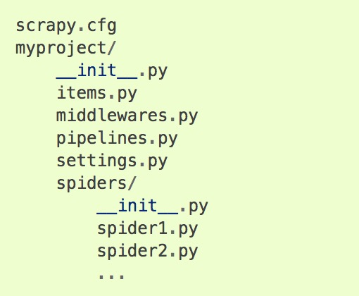

### 1.创建项目

命令行创建一个scrapy项目

```code
scrapy startproject 项目名
```

### 2.创建spider爬虫文件

可通过命令行创建spider文件

```code
scrapy genspider example example.com
```

创建好的文件为：


一般自定义文件内容

```python
import scrapy

class TestSpider(scrapy.Spider):
  	# 爬虫名称,识别不同的爬虫
  	name = 'test'
    # 请求的url,start_urls的写法，每个url请求完成之后，都只会默认调用parse函数
    start_urls = ['http://www.baidu.com', 'http://jd.com']
    # 还有一种写start_requests函数的形式
    def start_requests(self):
      	# 函数内可以指定不同的callback函数进行处理
      	urls = ['http://www.baidu.com', 'http://jd.com']
        for url in urls:
          	yield scrapy.Request(url=url, callback=self.self.parse)
    
    # 请求完之后，会自动调用的函数，用于解析响应
    def parse(self, response):
      	print(response)
```

### 3.运行爬虫文件

运行爬虫的命令

```code
scrapy crawl test
```

Scrapy会调度Spider方法scrapy.Request返回的对象start_requests。在收到每个响应后，它实例化Response对象并调用与请求相关的回调方法（在本例中为 parse方法），将响应作为参数传递。

### 4.scrapy shell调试器

```code
scrapy shell "http://www.baidu.com"
```

终端输入以上命令就会看到如下类似的东西，便可以看到时候能请求成功对应的地址，并获取到相应的东西

```python
2019-07-24 18:48:22 [scrapy.core.engine] DEBUG: Crawled (200) <GET http://www.baidu.com> (referer: None)
[s] Available Scrapy objects:
[s]   scrapy     scrapy module (contains scrapy.Request, scrapy.Selector, etc)
[s]   crawler    <scrapy.crawler.Crawler object at 0x1114119b0>
[s]   item       {}
[s]   request    <GET http://www.baidu.com>
[s]   response   <200 http://www.baidu.com>
[s]   settings   <scrapy.settings.Settings object at 0x111411be0>
[s]   spider     <DefaultSpider 'default' at 0x11191a518>
[s] Useful shortcuts:
[s]   fetch(url[, redirect=True]) Fetch URL and update local objects (by default, redirects are followed)
[s]   fetch(req)                  Fetch a scrapy.Request and update local objects 
[s]   shelp()           Shell help (print this help)
[s]   view(response)    View response in a browser
>>> 
>>> response
<200 http://www.baidu.com>
>>> response.css('#kw')
[<Selector xpath="descendant-or-self::*[@id = 'kw']" data='<input id="kw" name="wd" class="s_ipt" v'>]
```

注：本文不再讲解获取页面内容的语法，CSS选择器，xpath语法等知识已在selenium文章中讲解过，若有需要，请移步该文章。

### 5.存储爬取的数据到json文件中

在启动爬虫项目的时候添加如下参数

```code
scrapy crawl test -o test.json
```

以上命令是启动test爬虫，并将parse解析后返回的数据存储到test.json文件中。

### 6. 项目的默认结构



**scrapy.cfg**:该文件所在的目录成为项目根目录，文件内容包含项目的设置文件，上图的setting.py文件，还包含项目的配置deploy，可以给项目设置别名

**__init__.py**:该文件表示当前文件夹是一个python包，里面的.py文件可以被其他文件导入，在该文件里面可以写一些配置，当其他文件导入这个python包时，本文件夹下的内容将首先会被执行

**items.py**:该文件是项目的模块文件，相当于django中的modles.py文件，定义要存储的模型类，例如：

```python
import scrapy

class TestItem(scrapy.Item):
  
  # scrapy中就只需定义这样一个字段类型，因为它就只有这一个
  name = scrapy.Field()
  time = scrapy.Field()
```

**middlewares.py**:该文件默认带有两个中间件，分别为：项目名SpiderMiddleware和项目名DownloaderMiddelware。这两个中间件可以写一些中间处理，比如在下载中间件中可以设置一些request的属性，例如请求头，代理等。还可以对爬取后的数据做进一步的处理。爬虫中间件范围更广，它可以处理发送到调度器的请求、下载器返回的响应、传递给Item、pipeline的最终数据等，可以说整个爬虫的数据都要经过爬虫中间件。

**pippelines.py**:管道文件，编写连接数据库的类，例如mysql,redis等数据库进行数据存储。

**settings.py**:项目的配置文件，例如自行配置请求头、代理、爬取延时，自定义的中间件需要配置才回生效，并设置优先级别，一般数据库的连接属性我都放在这个文件里面，因为他是项目的配置文件，只要是配置，感觉放这里就对了。

**spiders**:该文件夹存放的是项目的爬虫文件

**spider1.py**:爬虫文件，这是整个爬虫的开始和“结束”，说他是开始，是因为整个爬虫的url是从这个文件开始定义和爬取的，将请求传递给调度器，调度器在下载器不忙碌的时候将请求发给下载器，下载器爬取内容后将相应传回给爬虫。start_urls内定义的url的响应会自动调用parse响应解析函数，也可以通过scrapy.Request请求对象自行定义回掉响应解析函数。响应解析函数的内容将传递给pipeline类进行存储。

### 7.项目文件的内容

**整个项目以爬取瓜子二手车为例**

自定义guazi.py文件，可使用一下命令创建

```code
scrapy genspider guazi guazi.com/cd/buy
```

```python
import scrapy
from guazispider.guazispider.items import VehicleItem


class GuaziSpider(scrapy.Spider):
  
    # 爬虫名称
    name = 'guazi'
    def start_requests(self):
      	"""定义爬取的url"""
      	for n in range(1, 51):
      			url = f'https://www.guazi.com/cd/buy/o{n}/#bread'
            yield scrapy.Request(url=url, callback=self.parse)
            
    def parse(self, response):
      	"""解析每个页面中每辆车的详情url"""
        sel = scrapy.Selector(response)
        cars = sel.xpath('/html/body/div[6]/ul/li')
        for car in cars:
          	href = car.xpath('./a/@href').extract_first()
            href = response.urljoin(href)
            yield scrapy.Request(url=href, callback=self.parse_detail)
    
    def parse_detail(self, response):
      	"""解析每一辆二手车的详情页"""
      	sel = scrapy.Selector(response)
        name = sel.xpath('//*[@class="titlebox"]/text()').extract_first()
        is_strictness = sel.xpath('//*[@class="labels baomai"]/text()').extract_first()
        is_transfer = sel.xpath('//*[@class="titlebox"]/span[2]/text()').extract_first()
        license_time = sel.xpath('//*[@class="assort clearfix"]/li[1]/span/text()').extract_first()
        mileage = sel.xpath('//*[@class="assort clearfix"]/li[2]/span/text()').extract_first()
        displacement = sel.xpath('//*[@class="assort clearfix"]/li[3]/span/text()').extract_first()
        speed_changing_box = sel.xpath('//*[@class="assort clearfix"]/li[4]/span/text()').extract_first()
        price = sel.xpath('//*[@class="pricestype"]/text()').extract_first()
        print(name, is_strictness, is_transfer, license_time, mileage, displacement, speed_changing_box)
        item = VehicleItem()
        item['name'] = name
        item['is_strictness'] = is_strictness
        item['is_transfer'] = is_transfer
        item['license_time'] = license_time
        item['mileage'] = mileage
        item['displacement'] = displacement
        item['speed_changing_box'] = speed_changing_box
        item['price'] = price
        yield item
```

**item.py**

```python
import scrapy


class VehicleItem(scrapy.Item):
  	
    name = scrapy.Field()
    price = scrapy.Field()
    is_strictness = scrapy.Field()
    is_transfer = scrapy.Field()
    license_time = scrapy.Field()
    mileage = scrapy.Field()
    displacement = scrapy.Field()
    speed_changing_box = scrapy.Field()
```

**middlewares.py**

```python
import time
from selenium import webdriver


class SeleniumMiddleware():
  	
    def __init__(self):
      	self.driver = webdriver.Chrome()
    
    def __del__(self):
      	self.driver.close()
    
    def process_request(self, request, spider):
      	"""这个函数返回了Response对象，此时其他中间件的process_request方法将不再执行，同时请求也不会传递给Downloader下载器进行下载，当此函数返回Response对象时，response将直接传递给spider组件的parse解析函数进行处理，相当于下载器的任务被这个中间件全权处理了"""
        self.driver.get(request.url)
        time.sleep(2)
        html = self.driver.page_source
        
        return HtmlResponse(url=request.url, body=html, encoding='utf-8')
```

pipeline.py

```python
import pymysql
from guazispider.guazispider.settings import MYSQL_USER, MYSQL_DB, MYSQL_HOST, MYSQL_PASSWORD, MYSQL_PORT


class MysqlPipeline():
  
  	def __init__(self, mysql_user, mysql_password, mysql_host, mysql_port, mysql_db):
      	self.mysql_user = mysql_user
        self.mysql_password = mysql_password
        self.mysql_host = mysql_host
        self.mysql_port = mysql_port
        self.mysql_db = mysql_db
    
    @classmethod
    def from_crawler(cls, crawler):
       return cls(MYSQL_USER, MYSQL_PASSWORD, MYSQL_HOST, MYSQL_PORT, MYSQL_DB)
    
    def open_spider(self, spider):
      	"""当开始爬虫的时候，引擎进过中间件就会调用此方法，在此进行mysql数据库的连接"""
        self.client = pymysql.Connection(host=self.mysql_host, port=self.mysql_port, password=self.password, user=self.user, database=self.mysql_db)
        self.cursor = self.client.cursor()
        
    def close_spider(self, spider):
      	"""当爬虫的parse解析函数返回结果时，此方法被调用"""
        self.client.close()
    
    def process_item(self, item, spider):
      	"""当爬虫将数据传递给item pipeline组件时此方法被调用"""
        sql = 'insert into vehicle (name, is_strictness, is_transfer, license_time, mileage, displacement, speed_changing_box, ' \
              'price) values ("{}", "{}", "{}", "{}", "{}", "{}", "{}", "{}")'.format(item['name'], item['is_strictness'],
                                                                                      item['is_transfer'], item['license_time'],
                                                                                      item['mileage'], item['displacement'],
                                                                                      item['speed_changing_box'], item['price'])
          self.cursor.execute(sql)
          self.client.commit()
      
      
class MongoDBPipeline():
  
  	def __init__(self):
      	# 建立MongoDB数据库连接
        client = pymongo
        # 连接所需数据库,guazi为数据库名
        db = client['guazi']
        # 连接所用集合，也就是我们通常所说的表，guazi为表名
        self.guazi = db['guazi']
    
    def process_item(self, item, spider):
      	guazi_item = dict(item)  # 把item转化成字典形式
        self.guazi.insert(guazi_item)
        return item  # 会在控制台输出原item数据，可以选择不写
```

settings.py

```python
# -*- coding: utf-8 -*-

# Scrapy settings for dbspider project
#
# For simplicity, this file contains only settings considered important or
# commonly used. You can find more settings consulting the documentation:
#
#     https://docs.scrapy.org/en/latest/topics/settings.html
#     https://docs.scrapy.org/en/latest/topics/downloader-middleware.html
#     https://docs.scrapy.org/en/latest/topics/spider-middleware.html

BOT_NAME = 'dbspider'

SPIDER_MODULES = ['dbspider.spiders']
NEWSPIDER_MODULE = 'dbspider.spiders'


# Crawl responsibly by identifying yourself (and your website) on the user-agent
USER_AGENT = 'Mozilla/5.0 (Macintosh; Intel Mac OS X 10_13_6) AppleWebKit/537.36 (KHTML, like Gecko) Chrome/75.0.3770.100 Safari/537.36'

# Obey robots.txt rules
# 设置是否准寻robots.txt文件的规则
ROBOTSTXT_OBEY = True

# Configure maximum concurrent requests performed by Scrapy (default: 16)
# 可以在这里设置最大并发请求数
#CONCURRENT_REQUESTS = 32

# Configure a delay for requests for the same website (default: 0)
# See https://docs.scrapy.org/en/latest/topics/settings.html#download-delay
# See also autothrottle settings and docs
# 可以在这里设置下载器的下载延迟，秒
# DOWNLOAD_DELAY = 3
# The download delay setting will honor only one of:
#CONCURRENT_REQUESTS_PER_DOMAIN = 16
#CONCURRENT_REQUESTS_PER_IP = 16

# Disable cookies (enabled by default)
#COOKIES_ENABLED = False

# Disable Telnet Console (enabled by default)
#TELNETCONSOLE_ENABLED = False

# Override the default request headers:
# 可以在这里设置默认的请求头信息
#DEFAULT_REQUEST_HEADERS = {
#   'Accept': 'text/html,application/xhtml+xml,application/xml;q=0.9,*/*;q=0.8',
#   'Accept-Language': 'en',
#}

# Enable or disable spider middlewares
# See https://docs.scrapy.org/en/latest/topics/spider-middleware.html
#SPIDER_MIDDLEWARES = {
#    'dbspider.middlewares.DbspiderSpiderMiddleware': 543,
#}

# Enable or disable downloader middlewares
# See https://docs.scrapy.org/en/latest/topics/downloader-middleware.html
# 使定义在下载中间件中的SeleniumMiddleware中间件生效
DOWNLOADER_MIDDLEWARES = {
   # 'dbspider.middlewares.DbspiderDownloaderMiddleware': 543,
   'dbspider.middlewares.SeleniumMidlleware': 543,
}

# Enable or disable extensions
# See https://docs.scrapy.org/en/latest/topics/extensions.html
#EXTENSIONS = {
#    'scrapy.extensions.telnet.TelnetConsole': None,
#}

# Configure item pipelines
# See https://docs.scrapy.org/en/latest/topics/item-pipeline.html
# 使MongoDBpipeline类生效，即可存入MongoDB数据库
ITEM_PIPELINES = {
   # 'dbspider.pipelines.DbspiderPipeline': 300,
   # 'dbspider.pipelines.RedisPipeline': 300,
   'dbspider.pipelines.MongoDBPipeline': 300,
}

# Enable and configure the AutoThrottle extension (disabled by default)
# See https://docs.scrapy.org/en/latest/topics/autothrottle.html
#AUTOTHROTTLE_ENABLED = True
# The initial download delay
#AUTOTHROTTLE_START_DELAY = 5
# The maximum download delay to be set in case of high latencies
#AUTOTHROTTLE_MAX_DELAY = 60
# The average number of requests Scrapy should be sending in parallel to
# each remote server
#AUTOTHROTTLE_TARGET_CONCURRENCY = 1.0
# Enable showing throttling stats for every response received:
#AUTOTHROTTLE_DEBUG = False

# Enable and configure HTTP caching (disabled by default)
# See https://docs.scrapy.org/en/latest/topics/downloader-middleware.html#httpcache-middleware-settings
#HTTPCACHE_ENABLED = True
#HTTPCACHE_EXPIRATION_SECS = 0
#HTTPCACHE_DIR = 'httpcache'
#HTTPCACHE_IGNORE_HTTP_CODES = []
#HTTPCACHE_STORAGE = 'scrapy.extensions.httpcache.FilesystemCacheStorage'

# mysql的配置
MYSQL_USER = 'root'
MYSQL_PASSWORD = password
MYSQL_HOST = '127.0.0.1'
MYSQL_PORT = 3306
MYSQL_DB = 'guazi'
```

当设置了DOWNLOAD_DELAY的值后，CONCURRENT_REQUESTS设置的并发进程将受到限制，网上有人测试结果是：DOWNLOAD_DELAY设置值为5秒，在程序开始到5秒后，处理的进程只有1个，接下来才继续处理其他的进程，所以感觉这两个设置不应该同时配置。

CONCURRENT_REQUESTS_PER_DOMAIN指同一时间，有多少进程可以爬取所爬的域名

参阅连接[scrapy实战效率测评](https://www.urlteam.org/2016/07/scrapy学习笔记十一-scrapy实战效率测评/)    [参阅连接二](https://blog.csdn.net/s150503/article/details/72571680)

**以上是整个scrapy项目的文件内容**

### 8.scrapy+redis分布式爬取

**主机代码**

spider.py文件内容和普通爬虫一样

pipeline.py文件

```python
import redis


class RedisPipeline():
  
    def process_item(self, item, spider):
      	# 连接redis获取对象
    	  db = redis.Redis(host='127.0.0.1', port=6379, password="密码")
        # 向redis的列表中存入数据
        db.lpush('guazi:urls', item['href'])
        
        return item   # 会在控制台输出原item数据，可以选择不写
```

settings.py

```python
ITEM_PIPELINES = {
   'dbspider.pipelines.RedisPipeline': 300,
}
```

**从机代码**

spider.py

```python
from scrapy_redis.spider import RedisSpider
from scrapy import Selector

from slavespider.items import OwnerItem


class GuaziSpider(RedisSpider):
  
  	name = 'guazi'
    # 从机需要从redis的list类型中取爬取的地址，而不是从start_urls中取地址
    redis_key = 'guazi:urls'
    
    def parse(self, response)
    sel.Selector(response)
    owner = sel.xpath('//*[@class="people-infor clearfix"]/dt/span/text()').extract_first()
        license_time = sel.xpath('//*[@class="one"]/div/text()').extract_first()
        mileage = sel.xpath('//*[@class="two"]/div/text()').extract_first()
        place = sel.xpath('//*[@class="four"]/div/text()').extract_first()
        speed_changing_box = sel.xpath('//*[@class="five"]/div/text()').extract_first()
        displacement = sel.xpath('//*[@class="six"]/div/text()').extract_first()
        is_transfer = sel.xpath('//*[@class="seven"]/div/text()').extract_first()
        see_car_type = sel.xpath('//*[@class="eight"]/div/text()').extract_first()
        annual_time = sel.xpath('//*[@class="nine"]/div/text()').extract_first()
        compulsory = sel.xpath('//*[@class="ten"]/div/text()').extract_first()
        business_time = sel.xpath('//*[@class="last"]/div/text()').extract_first()

        item = OwnerItem()
        item['owner'] = owner
        item['license_time'] = license_time
        item['mileage'] = mileage
        item['place'] = place
        item['speed_changing_box'] = speed_changing_box
        item['displacement'] = displacement
        item['is_transfer'] = is_transfer
        item['see_car_type'] = see_car_type
        item['annual_time'] = annual_time
        item['compulsory'] = compulsory
        item['business_time'] = business_time
        yield item
```

items.py

```python
import scrapy


class OwnerItem(scrapy.Item):

    owner = scrapy.Field()
    license_time = scrapy.Field()
    mileage = scrapy.Field()
    place = scrapy.Field()
    speed_changing_box = scrapy.Field()
    displacement = scrapy.Field()
    is_transfer = scrapy.Field()
    see_car_type = scrapy.Field()
    annual_time = scrapy.Field()
    compulsory = scrapy.Field()
    business_time = scrapy.Field()
```

如果需要存入mysql或MongoDB，pipeline.py文件内容和主机一样

可以直接存储在redis中，这样配置起来非常方便，直接在配置文件中加入以下内容

```python
ITEM_PIPTLINES = {
  	'scrapy_redis.pipeline.RedisPipeline': 300,
}
# 配置scrapy_redis里面的调度器，
SCHEDULER = "scrapy_redis.scheduler.Scheduler"
```

