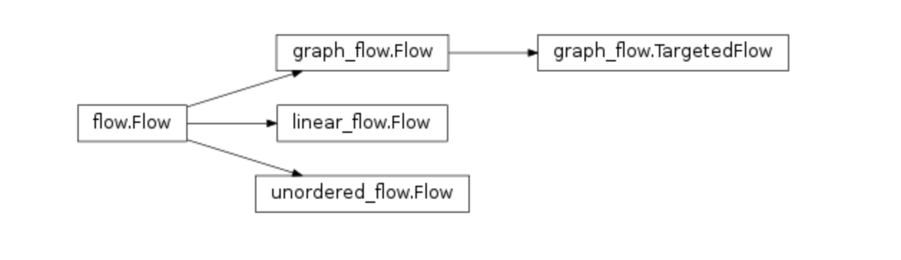

## 模式

**类Flow**


　　在TaskFlow中，模式Patern表示的是流的类型。一个flow，也称为流，是定义任务之间关系的结构。可以将一个或者多个任务加到流中，也可以将一个或者多个流加入到流中（内嵌的流称为子流）。流提供了隐式和显示的方法来定义流中任务/子流之间的依赖关系。
　　类Flow位于文件flow.py中定义。类Flow是所有flow类的基类，它是一个抽象类，所以无法直接进行实例化。基类Flow派生出了Linear Flow、Unordered Flow和Graph Flow。


**Linear Flow**

　　表示Linear Flow的类Flow位于文件patterns/linear_flow.py中定义。linear是线性的意思，也就是说在此流中的任务和子流是按照添加的顺序一个接着一个执行的。当其中的任务和子流发生失败时，也会安装相反的顺序一个接着一个的执行回滚操作。这种流类型是最基本也是最简单的。
　　下面是一个使用Linear Flow的例子：

```python
from taskflow import task, engines
from taskflow.patterns import linear_flow


class TaskA(task.Task):
    def execute(self):
        print('TaskA is executing.')

class TaskB(task.Task):
    def execute(self):
        print('TaskB is executing.')

task_a = TaskA('task-a')
task_b = TaskB('task-b')

f = linear_flow.Flow('linear-flow')
f.add(task_a)
f.add(task_b)

engine = engines.load(f)
engine.run()
```


　　程序输出：

```python
TaskA is executing.
TaskB is executing.
```


　　上面的例子中，先向流中添加任务A，然后添加任务B。流执行时，先执行任务A，然后执行任务B。


**Unordered Flow**


　　表示Unordered Flow的类Flow位于文件patterns/unordered_flow.py中定义。unordered表示没有次序的、无序的，也就是说流中任务和子流的执行顺序与添加到流中的次序没有关联。下面是一个使用Unordered Flow的例子：

```python
from taskflow import task, engines
from taskflow.patterns import unordered_flow

import string

class MyTask(task.Task):
    def execute(self):
        print('%s is executing.' % self.name)

f = unordered_flow.Flow('linear-flow')

for ch in string.uppercase:
    t = MyTask('task-%s' % ch)
    f.add(t)

engine = engines.load(f)
engine.run()
```


　　程序输出：

```python
task-S is executing.
task-C is executing.
task-T is executing.
task-U is executing.
task-V is executing.
task-W is executing.
task-E is executing.
task-X is executing.
task-F is executing.
task-Y is executing.
task-G is executing.
task-Z is executing.
task-H is executing.
task-I is executing.
task-J is executing.
task-K is executing.
task-L is executing.
task-D is executing.
task-M is executing.
task-N is executing.
task-A is executing.
task-O is executing.
task-P is executing.
task-B is executing.
task-Q is executing.
task-R is executing.
```


　　上面的例子中，是按照字母顺序向流中添加任务的，但实际上并没有按照字母顺序执行。如果多次运行此例子，会发现每次执行的顺序都不一样。


**Graph Flow**


　　表示Graph Flow的类Flow位于文件patterns/graph_flow.py中定义。graph表示图形，这种流会按照依赖关系自动推断出执行的顺序。下面是一个使用Graph Flow的例子：

```python
from taskflow import task, engines
from taskflow.patterns import graph_flow

import string

class MyTask(task.Task):
    def execute(self, x):
        print('%s is executing x=%d.' % (self.name, x))
        return 10 * x

f = graph_flow.Flow('linear-flow')
f.add(
    MyTask('task-B', provides='c', rebind={'x': 'b'}),
    MyTask('task-A', provides='b', rebind={'x': 'a'}),
    MyTask('task-C', rebind={'x': 'c'}),
)

engines.run(f, store={'a': 1})
```


　　程序输出：

```python
task-A is executing x=1.
task-B is executing x=10.
task-C is executing x=100.
```


　　在上面的例子中，我们先分析三个任务的依赖关系。从provides和rebind的值可以分析出，三个任务的依赖关系是：task-C依赖于task-B，而task-B依赖于task-A。在程序中我们添加任务的顺序是：先添加task-B，然后添加task-A，最后添加task-C。因为使用的是Graph Flow类型的流，会自动推导出依赖关系，并按照依赖关系来执行。从输出来看，程序确实是按照依赖关系而非添加顺序来执行的。


类Flow的继承关系


　　类Flow是所有flow类的基类。

